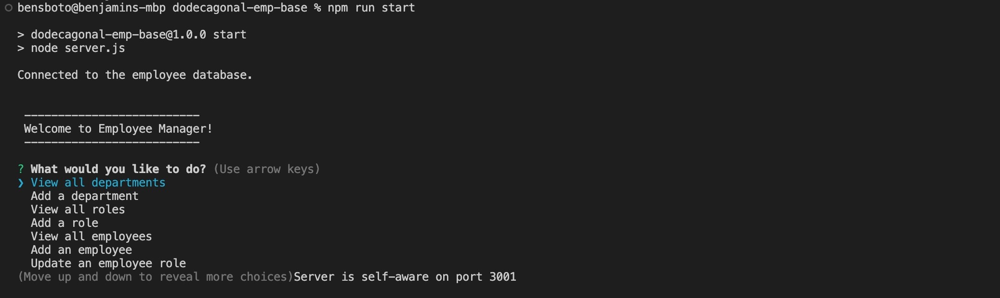
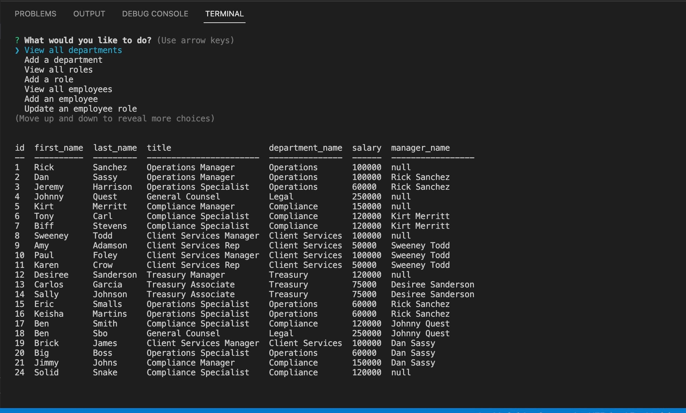

# 12 SQL: Employee Tracker

## User Story

```md
AS A business owner
I WANT to be able to view and manage the departments, roles, and employees in my company
SO THAT I can organize and plan my business
```

## Acceptance Criteria

```md
GIVEN a command-line application that accepts user input
WHEN I start the application
THEN I am presented with the following options: view all departments, view all roles, view all employees, add a department, add a role, add an employee, and update an employee role
WHEN I choose to view all departments
THEN I am presented with a formatted table showing department names and department ids
WHEN I choose to view all roles
THEN I am presented with the job title, role id, the department that role belongs to, and the salary for that role
WHEN I choose to view all employees
THEN I am presented with a formatted table showing employee data, including employee ids, first names, last names, job titles, departments, salaries, and managers that the employees report to
WHEN I choose to add a department
THEN I am prompted to enter the name of the department and that department is added to the database
WHEN I choose to add a role
THEN I am prompted to enter the name, salary, and department for the role and that role is added to the database
WHEN I choose to add an employee
THEN I am prompted to enter the employee’s first name, last name, role, and manager, and that employee is added to the database
WHEN I choose to update an employee role
THEN I am prompted to select an employee to update and their new role and this information is updated in the database 
```

## Developer Notes
- This application was developed using Command Line Interface with the node inquirer package. 
- To initiate the application run the command 'node server.js' or 'npm run start'
- The main Inquirer menu features scroll-through functionality, use the arrow keys - up and down to navigate through and press enter to go into a sub-menu
- Once you've run a query you can continue selecting more options by pressing up/down on the arrow keys
- Additional functionality was developed to allow for viewing data by departments, managers, deletion of records etc.
- Since the mySQL server requires a password to enter, a local environment variable was created to store that and added to the gitIgnore file to ensure the password is not shared on a public website. 

## Future Development
- Right now the app is built around entering valid id's to perform the addition and delete functions. In the future I'd like to add functionality to call the database and render current lists.

## Screenshot of Running Application
- Upon Launch:


- Example of View All Employees Query



## Walkthrough Video
Link to walkthrough video can be found here:

- https://drive.google.com/file/d/1o99OZGSYvzaXC1gSHse3rfWmpSy6HYC7/view